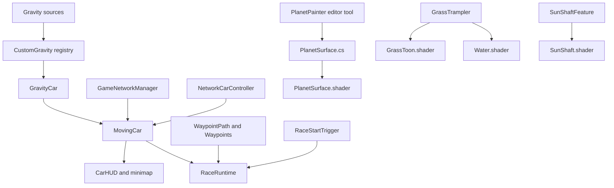
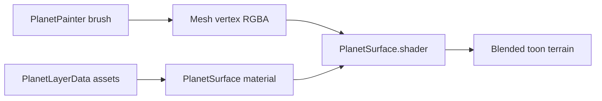
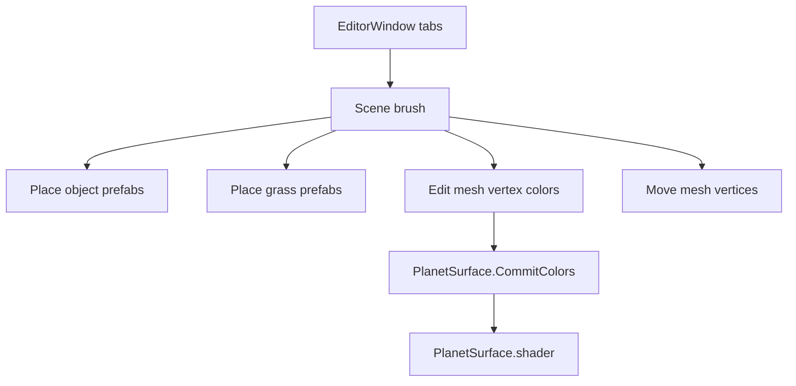
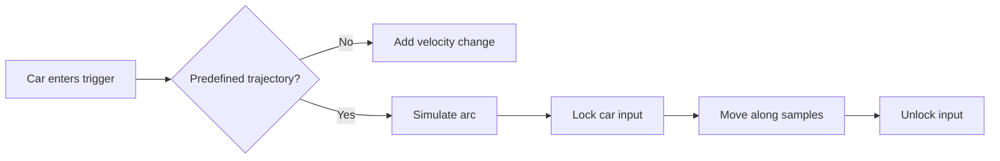
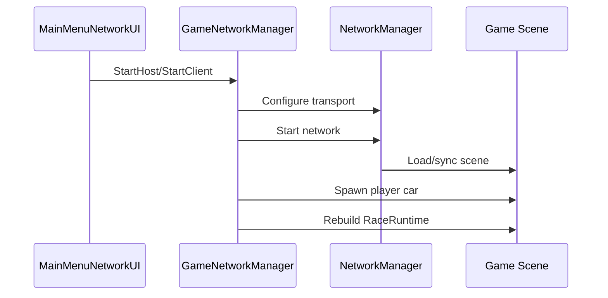
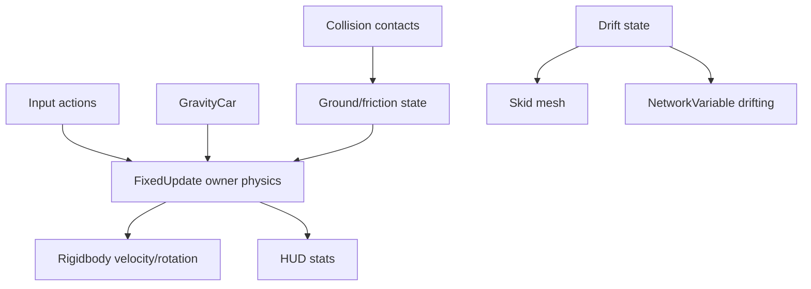
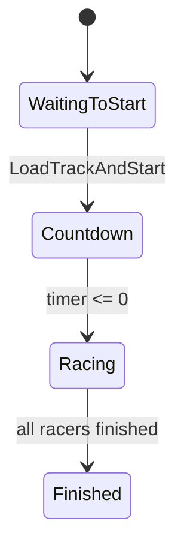
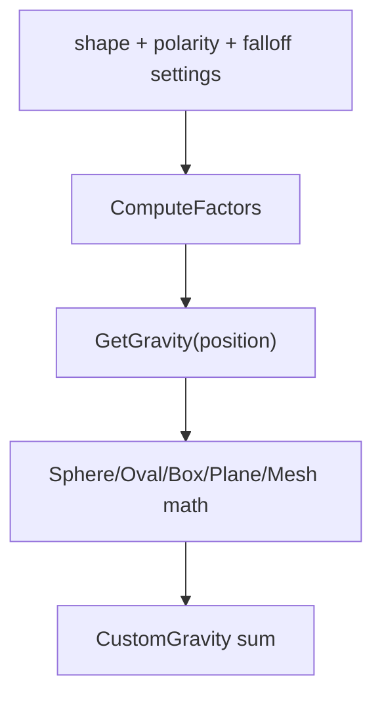

# Code And Shader Explanation Report

This report covers the project-owned C# scripts under `Assets/scripts` and `Assets/Editor`, plus the custom shaders under `Assets/Art`. It intentionally skips third-party/generated packages, TextMesh Pro shaders, build output, and package code.

No `TODO`, `FIXME`, `HACK`, `BUG`, `REVIEW`, or `XXX` markers were found in the selected files. Many files use decorative comment dividers and Unicode symbols; those are useful in the Unity editor, but they can render as mojibake in some terminals, so ASCII-only comments would be easier to preserve across tools.



## File: Assets/Art/Environment/Clouds/Shaders/VolumetricCloud.shader

**What it does:** Draws a stylized volumetric cloud shell for URP. It uses procedural noise, fake depth, alpha blending, toon lighting, and sun scatter to make a sphere-like cloud volume feel fluffy from outside and denser from inside.

**Defines:** Shader `Custom/VolumetricCloud`, one `ToonCloud` forward pass, noise helpers, `Attributes`, and `Varyings`.

**Existing comments:** The comments explain the noise block, vertex/fragment stages, interior-vs-exterior behavior, fake volume march, toon lighting, sky-lit shadows, and sun-edge scattering. They are useful and close to the math.

**Connections:** Used by cloud materials/prefabs under `Assets/Art/Environment/Clouds`; visually complements `PlanetAtmosphere.shader`.

**Illustration:**
```text
sphere mesh -> noise normal/alpha -> fake volume depth -> toon cloud color
```

**Suggestions:** Add a short top-level note listing the key material properties artists should tune first. If this shader is expensive on lower-end targets, expose a lower-quality keyword or reduce the fixed fake-volume sample count.

-----

## File: Assets/Art/Environment/Grass/Shaders/GrassToon.shader

**What it does:** Renders alpha-cutout toon grass with root-to-tip coloring, wind animation, bloom-like tip emission, procedural tapering, and interactive trampling.

**Defines:** Shader `Custom/GrassToon`, shared HLSL block, `ForwardLit` pass, `ShadowCaster` pass, wind/trample helpers, and a 64-slot `_TrampleHistory` array.

**Existing comments:** Comments explain trample globals from `GrassTrampler.cs`, history stamps, mask import expectations, procedural tapering, debug height view, and shadow bias. This is one of the better-commented shaders.

**Connections:** `GrassTrampler.cs` writes the global trample position, strength, radius, time, recovery duration, and history used here. `PlanetPainter.cs` can place grass prefabs that use this material.

**Illustration:**
```text
GrassTrampler globals
        |
        v
wind + live trample + history stamps
        |
        v
alpha mask + taper + toon lighting
```

**Suggestions:** Consider moving the trample history size into a shared constant documented beside `GrassTrampler.MaxHistory`, since the C# and shader both assume 64 entries. Keep the import-setting comments because they prevent common grass-mask bugs.

-----

## File: Assets/Art/Environment/SunShafts/Shaders/SunShaft.shader

**What it does:** Performs a screen-space radial sample from the current frame toward the sun position to create god rays/sun shafts.

**Defines:** Shader `Hidden/Custom/SunShaft`, one `SunShaft_Radial` pass, fragment uniforms set by `SunShaftFeature.cs`.

**Existing comments:** The header says this is for URP 17 / Unity 6 and should be driven by `SunShaftFeature.cs`; inline comments identify per-frame shader values and behind-camera rejection.

**Connections:** Paired directly with `Assets/scripts/Rendering/SunShaftFeature.cs`, which allocates render graph passes and sets the shader properties each frame.

**Illustration:**
```text
camera color -> radial samples toward sun screen position -> blended shafts
```

**Suggestions:** Document expected property names in `SunShaftFeature.cs` as well, so renaming shader uniforms does not silently break the feature.

-----

## File: Assets/Art/Environment/Trees/Shaders/leavesShader.shader

**What it does:** Renders stylized alpha-cutout leaves with wind sway, two-sided lighting, color variation, and alpha-aware shadows.

**Defines:** Shader `Custom/LeavesToon`, shared wind block, `ForwardLit` pass, and `ShadowCaster` pass.

**Existing comments:** Comments explain the shared block, wind behavior, cutout logic, two-sided normal flipping, color calculation, and shadow caster behavior.

**Connections:** Used by tree leaf materials in `Assets/Art/Environment/Trees`. It shares a wind style with `GrassToon.shader`, giving foliage a consistent motion language.

**Illustration:**
```text
leaf texture alpha -> cutout -> wind sway -> toon lit color -> alpha-aware shadow
```

**Suggestions:** If tree and grass wind should always match, consider sharing the wind function through a small `.hlsl` include later. For now, keep the duplicated function commented because it is easy to tune per shader.

-----

## File: Assets/Art/Environment/Water/Shaders/Water.shader

**What it does:** Renders curved-world water with wave normals, toon-ish lighting, shore foam, Fresnel rim, fake sky/cloud reflections, and disturbance wakes that mirror the grass trample data.

**Defines:** Shader `Custom/Water`, one `WaterForward` pass, tangent-frame helpers, wave functions, trample/wake helpers, FBM reflection noise.

**Existing comments:** The comments are strong: they explain curved-surface tangent frames, surface-projected wave UVs, grass-matched trample logic, shore foam, wake edge brightening, and cloud reflections.

**Connections:** Reads the same global trample data written by `GrassTrampler.cs`, so a moving car can visibly disturb both grass and water.

**Illustration:**
```text
surface normal -> tangent waves -> trample wake -> foam/fresnel/reflection -> water color
```

**Suggestions:** Because this shader depends on globals with no material properties, add a short note to `GrassTrampler.cs` that water also consumes the globals. Consider a fallback visual when no trampler exists, to make editor previews clearer.

-----

## File: Assets/Art/Planet/Shaders/PlanetAtmosphere.shader

**What it does:** Draws an atmosphere shell around a planet using additive outer halo and alpha-blended inner rim passes.

**Defines:** Shader `Custom/PlanetAtmosphere`, `Atmosphere_Halo` pass, `Atmosphere_Rim` pass, altitude gradient, day/night terminator, Mie-style sun scatter, and toon rim bands.

**Existing comments:** The comments explain how to place the shader, the two-pass design, halo shape math, opacity banding, altitude gradient, day-side bias, backlit sunset color, and rim fade.

**Connections:** Intended for a sphere scaled slightly larger than the planet mesh. It visually pairs with `PlanetSurface.shader` but is not driven by C#.

**Illustration:**
```text
outer backfaces -> additive halo
inner frontfaces -> transparent rim
combined result -> readable planet atmosphere
```

**Suggestions:** Add a small material preset note in project docs for recommended scale and color values. If sorting artifacts appear, document queue/blend expectations near the shader header.

-----

## File: Assets/Art/Planet/Shaders/PlanetSurface.shader

**What it does:** Renders paintable planet terrain. Vertex colors choose up to four surface layers, each layer can have albedo/normal/mask textures, and the shader blends them with triplanar world-space projection, height/contrast options, toon lighting, rim light, ambient fill, shadows, and depth support.

**Defines:** Shader `Planet Painting/PlanetSurface`, properties for layers 0-3, `ForwardLit`, `ShadowCaster`, and `DepthOnly` passes, triplanar albedo/normal sampling, vertex-color weighting, height-based blend contrast, and SRP Batcher-compatible material buffers.

**Existing comments:** This is heavily and usefully commented. It explains layer-to-channel mapping, SRP Batcher layout requirements, hash UV variation, triplanar normal blending, height contrast, mask channels, toon quantization, additional lights, rim fade, and shadow/depth pass requirements.

**Connections:** `PlanetSurface.cs` pushes layer textures/scalars into the material. `PlanetPainter.cs` edits mesh vertex colors, which this shader interprets as layer weights.

**Illustration:**


**Suggestions:** The comments in `PlanetSurface.cs` describe property names with an underscore pattern like `_LayerN_Albedo`, while the shader uses `_Layer0Albedo` style names. The code currently matches the shader, so update only the documentation/comment wording later to avoid confusion. Keep the repeated CBUFFER layout comments because they protect SRP Batcher compatibility.

-----

## File: Assets/Art/Toon/Shaders/toon.shader

**What it does:** Provides a simple toon material with an outline pass followed by a forward lit pass.

**Defines:** Shader `Custom/toon`, `Outline` pass using expanded vertices, and a `UniversalForward` pass for quantized lighting.

**Existing comments:** There are few comments; the shader is short enough to read, but the outline and lighting assumptions are not explained much.

**Connections:** Used by toon materials in `Assets/Art/Toon`; conceptually matches the stylized lighting direction of the grass, leaves, clouds, and planet shaders.

**Illustration:**
```text
pass 1: expanded backface outline
pass 2: toon-lit surface color
```

**Suggestions:** Add a header comment explaining outline thickness units and whether the shader expects uniform object scale. Consider renaming the file to `Toon.shader` for C#-style casing consistency.

-----

## File: Assets/Editor/FindMissingScripts.cs

**What it does:** Adds `Tools/Find Missing Scripts` to the Unity editor and scans all loaded objects for missing MonoBehaviour/component slots.

**Defines:** Static editor utility class `FindMissingScripts` and menu method `Find`.

**Existing comments:** This file has no explanatory comments, but it is short and self-explanatory.

**Connections:** Editor-only maintenance tool. It does not affect runtime gameplay.

**Illustration:**
```text
menu click -> Resources.FindObjectsOfTypeAll<GameObject>() -> null component slots -> Console errors
```

**Suggestions:** Consider adding a summary comment that this can find missing scripts in scenes and loaded assets. If scanning large projects gets noisy, filter out package assets or hidden editor objects.

-----

## File: Assets/Editor/PlanetPainter.cs

**What it does:** Implements an all-in-one Unity editor window for painting planets and platforms. It can scatter object prefabs, scatter grass prefabs, paint vertex colors for the planet surface shader, sculpt mesh vertices, subdivide meshes, adjust render density, and manage ProBuilder conversion.

**Defines:** `PlanetPainter : EditorWindow`, `BrushMode`, `PaintState`, `PrefabUpAxis`, `RenderDensity`, many UI drawing methods, scene brush handling, surface painting, sculpting, prefab placement, grass placement, erasing, mesh subdivision, smoothing, ProBuilder reflection helpers, and container management.

**Existing comments:** This is one of the most thoroughly commented files. The top block explains tabs, quick start, surface painting, and sculpting. Inline comments describe layer/channel mapping, falloff math, normalization, ProBuilder safeguards, mesh baking steps, brush UI, danger-zone tools, and smoothing.

**Connections:** Works with `PlanetSurface.cs`, `PlanetLayerData.cs`, `PlanetSurface.shader`, mesh renderers/filters, ProBuilder meshes, object/grass prefabs, and Unity undo/dirty APIs.

**Illustration:**


**Suggestions:** This file is feature-rich enough to split later into focused helpers: UI panels, brush sampling, mesh editing, ProBuilder utilities, and prefab placement. That would make the current good comments even more useful. Also consider replacing decorative Unicode separators with ASCII headings to avoid encoding corruption in terminals.

-----

## File: Assets/Editor/SmoothNormalsBaker.cs

**What it does:** Adds `Tools/Bake Smooth Normals` to the Unity editor. For selected objects, it duplicates the mesh if needed, averages normals for shared vertex positions, and stores the smoothed normal direction in mesh tangents.

**Defines:** `SmoothNormalsBaker`, menu method `BakeSmoothNormals`, and helper `Bake`.

**Existing comments:** No comments are present. The code is compact but the tangent-storage trick is non-obvious.

**Connections:** Likely supports toon/outline shaders or stylized normals workflows.

**Illustration:**
```text
selected mesh -> group equal positions -> average normals -> write tangent xyz
```

**Suggestions:** Add a short comment explaining why smoothed normals are stored in tangents, since that is shader-contract behavior. Consider marking generated meshes dirty and saving assets explicitly if artists expect persistence outside the scene.

-----

## File: Assets/Editor/WaypointPathEditor.cs

**What it does:** Custom inspector and Scene view tool for `WaypointPath`. It lets designers pick a planet, scan scene planets, place waypoints by clicking surfaces, move/reorder/remove waypoints, align waypoints to gravity, and clear paths.

**Defines:** `WaypointPathEditor : Editor`, planet picker state, inspector UI, Scene GUI placement mode, gravity/up-axis helpers, and toolbar actions.

**Existing comments:** Comments divide lifecycle, inspector, planet picker, placement tools, waypoint list, Scene GUI, planet helpers, gravity helpers, and toolbar helpers. They also explain fallback behavior for selected planet, live gravity, and nearest `GravitySphere`.

**Connections:** Edits `WaypointPath`, creates `Waypoint` objects, consults `Planet`, `CustomGravity`, and `GravitySphere`.

**Illustration:**
```text
click surface -> raycast hit -> choose up axis -> WaypointPath.AddWaypoint
```

**Suggestions:** The current comments are helpful. Consider warning if placement raycasts hit non-track colliders, since accidental waypoint placement on helpers/props can be confusing.

-----

## File: Assets/scripts/Camera/OrbitCamera.cs

**What it does:** Third-person orbit camera that follows a focus target, aligns to custom gravity, supports manual and automatic rotation, adjusts pitch by speed, smooths camera output, and handles occlusion with a box cast.

**Defines:** `OrbitCamera : MonoBehaviour`, focus assignment, local-player focus search, gravity alignment, focus smoothing, manual rotation, automatic rotation, speed-driven pitch, and angle clamping.

**Existing comments:** Comments explain focus/distance/rotation/pitch/gravity sections, the jitter fix where rotation is smoothed before deriving position, occlusion casting, zero-gravity guards, NaN guards, dead-zone speed noise, and smoothing the car facing direction.

**Connections:** Follows `MovingCar`, uses `Rigidbody` speed, uses `CustomGravity.GetUpAxis`, and is bound by `RaceRuntime`/`LocalPlayerCanvasBinder`.

**Illustration:**
```text
focus target + gravity up + input/look intent -> smoothed rotation -> camera position
```

**Suggestions:** Consider documenting expected input bindings near the `InputAction` setup. The jitter comments are valuable and should stay.

-----

## File: Assets/scripts/Gameplay/BoostPad.cs

**What it does:** Trigger-based boost pad for `MovingCar`. It can apply an immediate velocity change or drive the car through a precomputed ballistic trajectory while input is locked.

**Defines:** `BoostPad`, `TrajectorySample`, `TrajectoryResult`, `BoostDirection`, boost/cooldown/trajectory/visual settings, trajectory simulation, fixed-step trajectory following, glow feedback, and editor gizmo preview.

**Existing comments:** Comments explain trigger placement, boost directions, additive vs replacement velocity, cooldown/one-shot behavior, predefined trajectory, preview accuracy, visual feedback, trajectory sampling, and editor-only gizmos.

**Connections:** Calls `MovingCar.SetTrajectoryLocked`, reads `GravityCar.UpAxis`, uses `CustomGravity.GetGravity` for trajectory prediction, and uses renderer material color for feedback.

**Illustration:**


**Suggestions:** In multiplayer, consider guarding boost authority so only the owning/server-authoritative car applies boost. Also consider using `MaterialPropertyBlock` for pad glow to avoid instantiating renderer materials.

-----

## File: Assets/scripts/Gameplay/CarHUD.cs

**What it does:** Runtime dashboard for the local car. It binds to a `MovingCar` and optional `RaceRuntime`, then updates speed, direction, acceleration, speedometer dial, torque graph, handling stats, world/gravity stats, race panel, and debug text.

**Defines:** `CarHUD : MonoBehaviour`, auto-binding, UI auto-wiring, torque graph texture generation/redraw, speed/handling/world/race/debug update methods, formatting helpers.

**Existing comments:** Comments organize the UI reference groups and explain expected UI components like filled radial images, torque graph `RawImage`, yaw-rate bars, race labels, and debug blocks.

**Connections:** Reads public stats from `MovingCar`, reads race state from `RaceRuntime`, and can be bound by `LocalPlayerCanvasBinder`.

**Illustration:**
```text
MovingCar stats + RaceRuntime state -> CarHUD text, graph, dial, bars
```

**Suggestions:** If the HUD grows further, split graph drawing into a small helper class. Add null-reference warnings for critical UI fields only once, not every frame, if debugging UI setup becomes hard.

-----

## File: Assets/scripts/Gameplay/CheckpointMarker.cs

**What it does:** Visual marker for race checkpoints. It detects whether it is the next checkpoint and changes color/visibility behavior accordingly.

**Defines:** `CheckpointMarker : MonoBehaviour`, color settings, waypoint index caching, renderer color application, and basic update behavior.

**Existing comments:** Few comments, mostly field-level intent through names and attributes.

**Connections:** Spawned and managed by `RaceRuntime`; associated with `Waypoint` order.

**Illustration:**
```text
RaceRuntime active waypoint -> marker compares index -> normal/next color
```

**Suggestions:** Add a short class summary explaining whether marker state is driven by polling `RaceRuntime` or direct assignment. If many markers exist, avoid per-frame expensive searches.

-----

## File: Assets/scripts/Gameplay/GameNetworkManager.cs

**What it does:** High-level network coordinator. It configures Unity Transport, starts host/server/client modes, loads the game scene, tracks scene synchronization, spawns player cars, handles disconnect/failure status, caches spawn points, and applies command-line/hosting overrides.

**Defines:** `GameNetworkManager : MonoBehaviour`, singleton access, network start/shutdown API, scene event subscription, client connection callbacks, player spawning, spawn-point discovery/sorting, endpoint parsing, and command-line override parsing.

**Existing comments:** Comments divide networking, scene, spawning, lifecycle, event handling, helpers, and command-line behavior. They explain spawn point fallback by tag/name and scene sync timing.

**Connections:** Uses Unity Netcode `NetworkManager`, `UnityTransport`, scene management, `RaceRuntime`, and the networked car prefab.

**Illustration:**


**Suggestions:** This is important enough to add a short comment near authority decisions that clarifies host/server/client responsibilities. Consider logging endpoint parse failures with the rejected endpoint to speed up connection debugging.

-----

## File: Assets/scripts/Gameplay/GrassTrampler.cs

**What it does:** Writes global shader data describing the current trampler position and recent history stamps so grass and water can bend/react around the player.

**Defines:** `GrassTrampler : MonoBehaviour`, radius/strength/recovery/stamp-distance settings, 64 history slots, slot expiry, shader global upload, and gizmo drawing.

**Existing comments:** Tooltips explain radius, strength, recovery, and stamp distance. Inline comments are minimal but the data flow is clear.

**Connections:** Drives `_TramplePos`, `_TrampleRadius`, `_TrampleStrength`, `_TrampleHistory`, `_TrampleGameTime`, and `_RecoveryDuration` read by `GrassToon.shader` and `Water.shader`.

**Illustration:**
```text
car position -> live trample globals
movement stamps -> history globals
shaders -> bending/wake effects
```

**Suggestions:** Add a class summary naming both consuming shaders. Keep `MaxHistory` synchronized with the shader `TRAMPLE_HIST` constant, or centralize that value in documentation.

-----

## File: Assets/scripts/Gameplay/LocalPlayerCanvasBinder.cs

**What it does:** Keeps scene-level UI bound to the local player's runtime-spawned car. It finds/binds `CarHUD`, `minimap`, and `RaceRuntime` without putting screen UI on the car prefab.

**Defines:** `LocalPlayerCanvasBinder : MonoBehaviour`, UI caching, local car lookup, bind refresh, and network-aware local ownership checks.

**Existing comments:** The XML summary clearly explains the purpose. Inline comments are sparse but the file is straightforward.

**Connections:** Binds `MovingCar` into `RaceRuntime`, `CarHUD`, and `minimap`. Uses `NetworkManager` ownership checks.

**Illustration:**
```text
Canvas -> find local MovingCar -> bind HUD + minimap + RaceRuntime
```

**Suggestions:** Consider exposing a small debug status in the inspector for the currently bound car. The auto-add of `CarHUD` is convenient, but it could surprise designers if a Canvas was intentionally HUD-free.

-----

## File: Assets/scripts/Gameplay/MainMenuNetworkUI.cs

**What it does:** Simple menu UI wrapper around `GameNetworkManager`. It wires host/client/disconnect buttons, default address text, and status labels.

**Defines:** `MainMenuNetworkUI : MonoBehaviour`, button listeners, start host/client/disconnect methods, and status refresh.

**Existing comments:** No major comments; field and method names carry the intent.

**Connections:** Calls `GameNetworkManager.Instance`, reads `NetworkManager.Singleton`, and uses TextMeshPro/UI controls.

**Illustration:**
```text
buttons -> GameNetworkManager -> NetworkManager state -> status text/buttons
```

**Suggestions:** There appears to be an unreachable branch in `RefreshState`: once `GameNetworkManager.Instance != null`, the later branch that reads `GameNetworkManager.Instance.Port` inside an `else if` cannot run. Simplify that status logic later.

-----

## File: Assets/scripts/Gameplay/minimap.cs

**What it does:** Builds and updates a circular minimap for spherical/curved worlds. It creates a minimap camera, follows the local car from above its gravity up axis, displays the player dot, and projects waypoint dots with fading based on the car's equatorial plane.

**Defines:** `minimap : MonoBehaviour`, references/UI settings, camera settings, runtime camera/render texture setup, local car binding, dot creation/coloring, waypoint projection, and zoom/rotation smoothing.

**Existing comments:** The file has a strong XML summary and many useful comments explaining setup, culling masks, circle masks, camera construction, smoothing to avoid physics jitter, dot management, and waypoint side-of-planet fading.

**Connections:** Binds to `MovingCar` and `RaceRuntime`, reads `Planet.DotFadeDistance`, uses URP camera data, and is bound by `LocalPlayerCanvasBinder`.

**Illustration:**
```text
car position/up -> minimap camera
race waypoints -> projected UI dots
planet fade distance -> dot alpha
```

**Suggestions:** Rename the class/file to `Minimap` for C# naming consistency when safe. Also consider pooling waypoint dot UI objects if the active path changes frequently.

-----

## File: Assets/scripts/Gameplay/MovingCar.cs

**What it does:** Main spherical-world car controller. It handles custom gravity alignment, owner-only input, engine/brake/overdrive forces, steering, drift grip, jump/ground detection, surface friction, landing slip, networked drift state, remote skid mark visuals, runtime stats, and editor gizmos.

**Defines:** `MovingCar : NetworkBehaviour`, many tuning fields, HUD-facing stat properties, `TrailPoint`, input actions, network variable `_networkDrifting`, trajectory lock API for `BoostPad`, owner/non-owner network behavior, physics loop, collision evaluation, skid mark mesh generation/fading, and rich gizmo visualization.

**Existing comments:** The comments explain tuning groups, torque curves, overdrive, grip/drift, skid mark material expectations, stats accessors, surface friction, trajectory lock behavior, owner vs ghost cars, first-frame acceleration guard, input lock behavior, ground snapping, skid mesh allocation avoidance, and editor gizmos.

**Connections:** Requires `Rigidbody` and `GravityCar`; reads `SurfaceFriction`; is controlled by input and `BoostPad`; feeds `CarHUD`, `RaceRuntime`, `minimap`, and `NetworkCarController`; uses Unity Netcode ownership.

**Illustration:**


**Suggestions:** This is a central class and could eventually be split into movement, stats, input, and skid-mark components. Also review multiplayer authority for collision/boost interactions so only the owner/server mutates physics. The comments are valuable; keep them while refactoring.

-----

## File: Assets/scripts/Gameplay/MovingSphere.cs

**What it does:** Sphere/ball controller for custom-gravity movement. It reads input, applies acceleration/jump forces, detects ground/steep contacts, snaps to ground, and projects movement onto the current gravity-aligned surface.

**Defines:** `MovingSphere : MonoBehaviour`, movement/jump/ground settings, input actions, gravity-aware fixed update, contact evaluation, steep contact handling, velocity adjustment, and jump logic.

**Existing comments:** This file has little or no commenting compared with `MovingCar`.

**Connections:** Uses `CustomGravity`, `Rigidbody`, Unity Input System, and ground layers. It appears to be an alternate/earlier controller beside `MovingCar`.

**Illustration:**
```text
input + custom gravity + contact normals -> adjusted rigidbody velocity
```

**Suggestions:** Add a short header explaining whether this is still active gameplay or a prototype/reference controller. If still used, copy over the zero-gravity/NaN guard style from `MovingCar`/`GravityCar`.

-----

## File: Assets/scripts/Gameplay/NetworkCarController.cs

**What it does:** Network identity display for cars. On spawn, the owner submits a Steam or fallback display identity to the server, which replicates it through network variables to name tags.

**Defines:** `NetworkCarController : NetworkBehaviour`, `_steamId`, `_displayName`, owner identity submission, `SubmitIdentityServerRpc`, name tag refresh, and Steam fallback logic.

**Existing comments:** Comments identify the world-space name tag and fallback behavior. The code is short enough that this is mostly sufficient.

**Connections:** Requires `MovingCar`, uses Unity Netcode, optionally uses Steamworks through `SteamManager`, and updates TextMeshPro name tags.

**Illustration:**
```text
owner Steam/name -> ServerRpc -> NetworkVariables -> remote name tags
```

**Suggestions:** Consider server-side validation/truncation of display names before assigning the network variable. If `_useSteamIdentity` is false, documenting the fallback name format would help UI testing.

-----

## File: Assets/scripts/Gameplay/OrbitSpawner.cs

**What it does:** Spawns prefabs around an orbit center either as a ring or as a spherical shell/cover. It can randomize placement, scale, rotation, self-rotation, and optionally rotate the whole layer around the center.

**Defines:** `OrbitSpawner : MonoBehaviour`, `SpawnMode`, spawn settings, ring/cover spawning, Fibonacci sphere distribution, spawned-object cleanup, orbit/self-rotation update, and gizmo drawing.

**Existing comments:** Comments explain orbit target, spawn modes, ring/cover settings, even Fibonacci distribution, face-outward orientation, orbit rotation, scatter seed, and the Fibonacci sphere helper.

**Connections:** Useful for clouds, asteroids, decorations, or orbital obstacles around planets.

**Illustration:**
```text
center + mode + seed + prefabs -> spawned ring/shell objects -> optional orbit motion
```

**Suggestions:** Consider adding editor buttons for "Respawn" and "Clear" if designers use this often. If spawned objects should persist, document whether they are runtime-only or scene-authored.

-----

## File: Assets/scripts/Gameplay/Planet.cs

**What it does:** Lightweight planet metadata and registry. It stores a display name, minimap fade distance, track list, gravity source, and provides surface normal queries.

**Defines:** `Planet : MonoBehaviour`, `PlanetRegistry` static list, `SurfaceNormal`, registration lifecycle, track references, and public planet metadata.

**Existing comments:** Minimal comments, but field attributes and names explain most of it.

**Connections:** Used by `WaypointPathEditor`, `minimap`, `RaceRuntime`, and systems that need the planet's gravity source or track list.

**Illustration:**
```text
Planet component -> registry -> editors/UI/race/minimap discover planet data
```

**Suggestions:** Add a class summary describing the registry and whether multiple active planets are expected. Consider validating that `GravitySource` is present when used for surface normals.

-----

## File: Assets/scripts/Gameplay/RaceRuntime.cs

**What it does:** Central race state machine. It starts races from a waypoint path, runs countdown/racing/finished phases, tracks each racer's lap/checkpoint/time/position, updates HUD labels, points the next-waypoint arrow, spawns checkpoint markers, gates local input during countdown/finish, and accepts checkpoint reports by ServerRpc.

**Defines:** `RaceRuntime : NetworkBehaviour`, `RacePhase`, `RacerState`, race start API, player-car binding, countdown/race ticks, checkpoint/lap logic, ranking, HUD refresh, marker lifecycle, racer list building/resetting, input/arrow helpers, and formatting helpers.

**Existing comments:** Comments are strong: they explain multi-planet paths, HUD field meanings, player binding in multiplayer, free driving before race start, re-entry behavior, checkpoint crossing, lap completion, local input gating, arrow projection, and marker lifecycle.

**Connections:** Called by `RaceStartTrigger`, reads `WaypointPath`/`Waypoint`, binds to `MovingCar` and `OrbitCamera`, feeds `CarHUD`/`minimap`, and participates in Unity Netcode.

**Illustration:**


**Suggestions:** Because this class mixes UI, race rules, checkpoint markers, and networking, consider separating race model/rules from HUD updates later. Also review `ReportCheckpointServerRpc` against the local polling path so server-authoritative races cannot be spoofed.

-----

## File: Assets/scripts/Gameplay/RaceStartTrigger.cs

**What it does:** Trigger-zone component that starts a configured race when a player-tagged collider enters.

**Defines:** `RaceStartTrigger : MonoBehaviour`, track/path/lap/countdown settings, `RaceRuntime` reference, player tag, trigger setup, start call, and editor gizmo visualization.

**Existing comments:** The XML summary clearly explains placement and multi-planet waypoint paths. Tooltips explain track settings. Gizmo comment explains editor visualization.

**Connections:** Calls `RaceRuntime.LoadTrackAndStart` with a `WaypointPath`.

**Illustration:**
```text
player enters trigger -> LoadTrackAndStart(path, name, laps, countdown)
```

**Suggestions:** If cars have child colliders without the `Player` tag, use `GetComponentInParent<MovingCar>()` or compare root tags to avoid missed starts.

-----

## File: Assets/scripts/Gameplay/SurfaceFriction.cs

**What it does:** Per-surface friction override. `MovingCar` reads it from collided objects and averages contact friction into its grip logic.

**Defines:** `SurfaceFriction : MonoBehaviour`, serialized friction value, public `Friction` getter, and selected-object gizmo.

**Existing comments:** Tooltips/comments explain the intended range and gizmo purpose.

**Connections:** Consumed by `MovingCar.EvaluateCollision`.

**Illustration:**
```text
collision object -> SurfaceFriction.Friction -> MovingCar grip multiplier
```

**Suggestions:** Consider clamping friction in `OnValidate` so values stay physically meaningful even if edited through serialization.

-----

## File: Assets/scripts/Gameplay/Waypoint.cs

**What it does:** Represents a single race checkpoint/gate. It stores width, overshoot radius, detection radius, and draws gizmo rings.

**Defines:** `Waypoint : MonoBehaviour`, width/overshoot/color fields, `DetectionRadius`, and gizmo drawing helpers.

**Existing comments:** Comments/tooltips explain overshoot radius and gizmo behavior.

**Connections:** Used by `WaypointPath`, `WaypointPathEditor`, and `RaceRuntime`.

**Illustration:**
```text
Waypoint position + width + overshoot -> gate detection radius
```

**Suggestions:** Add a short note that `transform.up` is the waypoint's gate normal/up axis, since editor alignment depends on it.

-----

## File: Assets/scripts/Gameplay/WaypointPath.cs

**What it does:** Ordered list of `Waypoint` nodes for a race route. It handles next/previous indices, closest waypoint search, gate checks, reorder/removal, gravity alignment, and gizmo drawing of path arrows/gates.

**Defines:** `WaypointPath : MonoBehaviour`, waypoint list, loop flag, default overshoot, path query helpers, add/remove/reorder methods, gravity alignment, renumbering, path/gate gizmos.

**Existing comments:** Comments/tooltips explain default overshoot, path drawing, arrows, and gates; method names are clear.

**Connections:** Edited by `WaypointPathEditor`, read by `RaceRuntime`, references `Waypoint`, and uses `CustomGravity` for alignment.

**Illustration:**
```text
Waypoint[0..n] -> next index -> gate test -> RaceRuntime checkpoint progress
```

**Suggestions:** Add bounds guards to public getters if external callers can pass invalid indices. Consider exposing validation that warns on empty paths or null waypoints.

-----

## File: Assets/scripts/Gravity/AdaptiveGravitySource.cs

**What it does:** Unified configurable gravity source that can act like a sphere, oval/ellipsoid, box, plane, or mesh-driven gravity field. It supports internal/external polarity, shape-specific falloff zones, editor collider setup, and editor gizmos.

**Defines:** `AdaptiveGravitySource : GravitySource`, `GravityShape`, `BoxMode`, `FaceAxis`, many shape/falloff fields, `AdaptToShape`, ShowIf helpers, precomputed factors, mesh gravity, sphere/oval/box/plane gravity methods, editor collider setup, and gizmo drawing.

**Existing comments:** The file explains the replacement goal, enum meanings, polarity, oval scale behavior, mesh collider modes, precomputed reciprocals, shape math, mesh planet vs room behavior, finite plane behavior, editor-only setup, and gizmo meaning.

**Connections:** Registers through `GravitySource`/`CustomGravity`, feeds `GravityCar`, `CustomGravityRigidbody`, `OrbitCamera`, `MovingCar`, `BoostPad`, and waypoint alignment systems.

**Illustration:**


**Suggestions:** This is a good candidate to become the only gravity source after migration; document whether legacy `GravitySphere`, `GravityBox`, and `GravityPlane` should still be used. Watch for divide-by-zero in legacy-style falloff math when inner/outer distances are equal.

-----

## File: Assets/scripts/Gravity/CustomGravity.cs

**What it does:** Static registry and query API for all active `GravitySource` components. It sums gravity vectors, returns up axes, and finds the dominant source name for HUD/debug use.

**Defines:** `CustomGravity`, static source list, registration/unregistration, subsystem reset for no-domain-reload play mode, gravity summing, up-axis fallback, and dominant-source lookup.

**Existing comments:** Comments explain static reset, duplicate registration guard, redundant unregister safety, destroyed-source null guard, and zero-gravity up-axis fallback.

**Connections:** Used by gravity bodies, car/camera alignment, trajectory prediction, waypoint tools, and HUD stats.

**Illustration:**
```text
GravitySource.OnEnable -> register
query position -> sum source.GetGravity(position) -> gravity/up/source name
```

**Suggestions:** Consider pruning null sources during queries if scenes repeatedly create/destroy gravity sources. The current null guard prevents exceptions.

-----

## File: Assets/scripts/Gravity/CustomGravityRigidbody.cs

**What it does:** Generic rigidbody adapter for objects that should use custom gravity instead of Unity's built-in gravity. It can scale gravity, optionally align rotation to gravity up, and optionally let nearly-still bodies sleep.

**Defines:** `CustomGravityRigidbody : MonoBehaviour`, gravity scale, alignment settings, sleep optimization, `Awake`, `FixedUpdate`, and `AlignToUp`.

**Existing comments:** Comments explain gravity scaling, alignment/freeze rotation, sleeping behavior, baseline orientation, and the alignment interpolation pattern.

**Connections:** Consumes `CustomGravity`; useful for non-car rigidbodies on spherical/box/plane gravity fields.

**Illustration:**
```text
Rigidbody position -> CustomGravity.GetGravity -> AddForce + optional AlignToUp
```

**Suggestions:** If `alignToGravity` is enabled, expose whether user rotation is still allowed elsewhere. Consider clamping `gravityScale` in `OnValidate` for serialized safety.

-----

## File: Assets/scripts/Gravity/GravityBox.cs

**What it does:** Legacy/standalone box-shaped gravity source. It pulls objects toward outside faces or inner walls depending on position and falloff distances.

**Defines:** `GravityBox : GravitySource`, boundary distance, inner/outer falloff settings, `GetGravity`, `GetGravityComponent`, validation, and cube gizmo drawing.

**Existing comments:** This file has little commenting; the math is inherited from common custom-gravity examples and is less approachable than `AdaptiveGravitySource`.

**Connections:** Registered through `GravitySource` and summed by `CustomGravity`. `AdaptiveGravitySource` can mimic and extend it.

**Illustration:**
```text
position vs box bounds -> nearest face/vector -> gravity with falloff
```

**Suggestions:** Guard falloff factor division when falloff distance equals dead-zone distance. Add a header saying whether this is legacy now that `AdaptiveGravitySource` exists.

-----

## File: Assets/scripts/Gravity/GravityCar.cs

**What it does:** Car-specific gravity adapter. It disables built-in gravity, freezes physics rotation, applies custom gravity, and maintains a smoothed gravity alignment quaternion for `MovingCar`.

**Defines:** `GravityCar : MonoBehaviour`, `UpAxis`, `GravityAlignment`, `UpdateAndApplyGravity`, `RefreshGravityState`, and `UpdateAlignment`.

**Existing comments:** Comments explain why `MovingCar` calls it, why trajectory mode refreshes alignment without force, and why zero/NaN quaternion guards are needed.

**Connections:** Required by `MovingCar`; consumes `CustomGravity`; provides up/alignment data to car rotation and boost trajectory mode.

**Illustration:**
```text
CustomGravity -> UpAxis + GravityAlignment -> MovingCar orientation and force
```

**Suggestions:** This file is nicely scoped. If other vehicles appear, rename to something like `GravityAlignedRigidbody` only if it becomes shared.

-----

## File: Assets/scripts/Gravity/GravityPlane.cs

**What it does:** Simple plane gravity source. It pulls objects toward the plane from above within a configured range.

**Defines:** `GravityPlane : GravitySource`, gravity/range settings, `GetGravity`, and plane gizmos.

**Existing comments:** No meaningful comments; the file is small.

**Connections:** Registered by `GravitySource`, summed by `CustomGravity`, and replaced/extended by `AdaptiveGravitySource` plane mode.

**Illustration:**
```text
distance from plane -> fade gravity toward -up
```

**Suggestions:** Guard `range == 0` before dividing. Add a short note that this is one-sided; `AdaptiveGravitySource` has a both-sides option.

-----

## File: Assets/scripts/Gravity/GravitySource.cs

**What it does:** Base class for gravity providers. It registers with `CustomGravity` while enabled and provides a virtual default gravity method.

**Defines:** `GravitySource : MonoBehaviour`, virtual `GetGravity`, `OnEnable`, and `OnDisable`.

**Existing comments:** No comments, but it is very short.

**Connections:** Base class for all gravity sources; registration enables global gravity queries.

**Illustration:**
```text
enabled source -> CustomGravity list -> queried by bodies/camera/gameplay
```

**Suggestions:** Add XML documentation because this is a public extension point. Consider making the default `GetGravity` return `Vector3.zero` instead of `Physics.gravity` if accidental base instances should not affect custom-gravity worlds.

-----

## File: Assets/scripts/Gravity/GravitySphere.cs

**What it does:** Legacy/standalone spherical gravity source with inner and outer falloff ranges.

**Defines:** `GravitySphere : GravitySource`, gravity/radius/falloff settings, precomputed factors, `GetGravity`, validation, and sphere gizmos.

**Existing comments:** No explanatory comments; names and gizmos carry most of the meaning.

**Connections:** Registered with `CustomGravity`; used by older spherical-world logic and as an editor fallback in `WaypointPathEditor`.

**Illustration:**
```text
distance to center -> inner/outer falloff -> inward gravity vector
```

**Suggestions:** Guard factor calculations when radii are equal. Add a note that `AdaptiveGravitySource` sphere mode is the newer unified option if that is the intended direction.

-----

## File: Assets/scripts/Planet/PlanetLayerData.cs

**What it does:** ScriptableObject data asset for one paintable planet surface layer. It stores visual textures/scalars plus gameplay modifiers such as friction, speed, damage, hazard, and tag.

**Defines:** `PlanetLayerData : ScriptableObject`, layer identity/color, albedo/normal/mask textures, brightness, triplanar tiling/blend, metallic/smoothness/AO fallback values, and gameplay properties.

**Existing comments:** The XML summary explains vertex channel mapping and triplanar blending. Field tooltips explain how artists should use each property.

**Connections:** `PlanetSurface.cs` pushes this data into `PlanetSurface.shader`; `PlanetPainter.cs` shows layer buttons and writes vertex-color weights.

**Illustration:**
```text
LayerData slot 0..3 -> material properties + vertex color channel meaning
```

**Suggestions:** If gameplay properties become active, add code comments near consumers showing exactly how `frictionMultiplier`, `speedMultiplier`, and hazards are applied.

-----

## File: Assets/scripts/Planet/PlanetSurface.cs

**What it does:** Runtime/editor bridge between a paintable mesh, up to four `PlanetLayerData` assets, and the `PlanetSurface` shader. It initializes mesh vertex colors, exposes color get/set/commit APIs for `PlanetPainter`, pushes layer material properties, and can query the dominant layer at a world point.

**Defines:** `PlanetSurface : MonoBehaviour`, `layers`, `surfaceMaterial`, mesh/cache fields, `Init`, `GetColor`, `SetColor`, `CommitColors`, `PushMaterialProperties`, `GetLayerAtPoint`, and material texture helper.

**Existing comments:** Comments are excellent. They explain layer-to-vertex-channel mapping, cache lifecycle, default red-channel initialization, batching color writes before commit, material property naming, and nearest-vertex gameplay queries.

**Connections:** Used by `PlanetPainter.cs`; drives `PlanetSurface.shader`; reads `PlanetLayerData`; can support gameplay surface queries from controllers.

**Illustration:**
```text
mesh vertex colors <-> PlanetPainter
PlanetLayerData -> PlanetSurface.cs -> material properties -> PlanetSurface.shader
```

**Suggestions:** `GetLayerAtPoint` is O(vertex count), which is fine for occasional queries but expensive per frame on dense planets; cache a spatial lookup or use hit triangle barycentric data if this becomes gameplay-critical. Also fix the property-name comment to match `_Layer0Albedo` style names.

-----

## File: Assets/scripts/Rendering/SunShaftFeature.cs

**What it does:** URP renderer feature that runs the sun-shaft screen-space shader. It creates a material, schedules render graph raster passes, computes sun screen position, sets shader uniforms, and blits shafts back into the camera color target.

**Defines:** `SunShaftFeature`, settings fields for color/shape/occlusion/render pass event, pass data, material lifecycle, render graph pass setup, and `Dispose`.

**Existing comments:** Comments are light, but field headers explain controls. The shader contains more of the algorithm explanation.

**Connections:** Paired with `Assets/Art/Environment/SunShafts/Shaders/SunShaft.shader` and URP render graph APIs.

**Illustration:**
```text
URP camera color -> Sun Shafts render pass -> SunShaft.shader -> blit back
```

**Suggestions:** Add comments beside shader property IDs/uniform setup so the script/shader contract is obvious. If not already done, guard missing shader/material cases with one clear warning.

-----

## File: Assets/scripts/Steamworks.NET/SteamManager.cs

**What it does:** Initializes and shuts down Steamworks.NET for the game, exposes `SteamManager.Initialized`, runs Steam callbacks, handles restart/app initialization errors, and protects against duplicate managers.

**Defines:** `SteamManager : MonoBehaviour`, singleton instance, initialization state, debug callback hook, play-mode initialization, `Awake`, `OnEnable`, `OnDestroy`, and `Update`.

**Existing comments:** This file has many upstream-style comments explaining what the manager does, why `OnDestroy` is risky for Steam calls, reasons Steam init can fail, and shutdown-order caveats.

**Connections:** `NetworkCarController` optionally reads Steam identity through Steamworks after this manager initializes.

**Illustration:**
```text
SteamManager awake -> SteamAPI.Init -> Initialized flag -> callbacks every Update
```

**Suggestions:** Since this likely comes from Steamworks.NET sample code, avoid heavy edits. Consider documenting whether this local copy should be treated as vendor code despite living under `Assets/scripts`.

